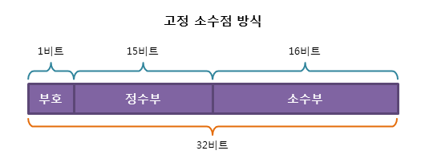
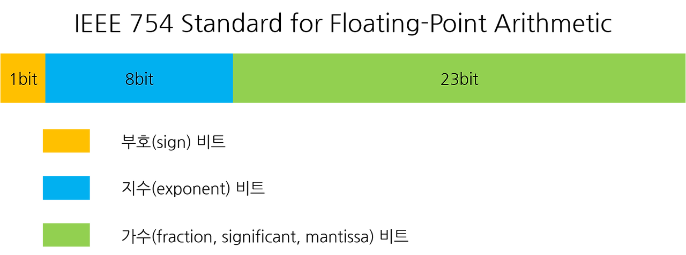

## 오인성

컴퓨터에서의 실수를 표현하는 방식에는 2가지 있다.

- 고정 소수점(fixed point) 방식
- 부동 소수점(floating point) 방식

## 고정 소수점(Fixed Point) 이란

고정 소수점(fixed point)은 정수를 표현하는 비트와 소수를 표현하는 비트수를 미리 고정하고 해당 비트만을 활용하여 실수를 표현한다.

### 개념 및 원리

- 처음 1비트는 sign(부호)을 나타낸다. 양수는 0, 음수는 1
- 다음 15비트는 integer part(정수부)를 나타낸다.
- 다음 16비트는 fractional part(소수부)를 나타낸다.
- 그리고 정수부와 소수부의 경계를 소수점의 위치라고 생각하고 2진수로 변환된 수를 그대로 넣으면 된다.
- 마지막으로 남는 자리는 모두 0으로 채우면 된다.

이러한 방식으로 실수를 표현하면, 특정한 범위 내에서 정밀하게 실수를 표현할 수 있다. 특히, 고정된 비트 크기를 유지하기 때문에 하드웨어에서 효율적으로 연산을 수행할 수 있다.



### EX

7.625 라는 실수를 만약에 고정 소수점으로 표현한다면
7.625 (10) =2² × 1 + 2¹ ×1 +20 ×1 +2-1 ×1 +2-2 ×0 +2-3 ×1 = 111.101(2)
으로 표현될 수 있다.

### 장점과 단점

#### 장점

- 하드웨어에서 연산이 빠르고 효율적이며, 부동 소수점보다 연산 비용이 낮다.
- 특정한 범위 내에서는 정밀한 표현이 가능하다.
- 일정한 비트 수를 유지하므로 메모리 사용량이 예측 가능하고 관리가 용이하다.

#### 단점

- 표현할 수 있는 값의 범위가 제한되어 있으며, 정밀도를 조절하려면 비트 수를 증가시켜야 한다.
- 오버플로우 및 언더플로우의 위험이 크며, 부동 소수점보다 유연성이 떨어진다.
- 소수부의 크기가 고정되어 있어, 작은 값들을 표현할 때 부정확한 결과가 나올 수 있다.

## 부동 소수점(Floating Porng) 이란

### 개념 및 원리



### IEEE 754 표준

### 장점과 단점

## 부동 소수점 오류

### 근사 오류 (소수점 정밀도 문제)

### 연산 순서에 따른 오차 누적

### 대표적인 예제 (예: 0.1 + 0.2 ≠ 0.3 문제)

부동 소수점 방식은 고정 소수점 방식보다 훨씬 더 많은 범위까지 표현할 수 있지만, 항상 오차가 존재한다는 단점을 가지고 있다.

부동 소수점 방식에서 오차는 위에서 살펴본 공식에 의해 발생한다.

해당 공식을 사용하면 표현할 수 있는 범위는 늘지만, 10진수를 정확하게 표현할 수는 없다. (무한소수, 순환소수의 경우 가수부가 표현할 수 있는 비트 수를 넘어가게 되면 손실되는 부분이 생기기 때문, 실수 또한 이진수로 표현하기 때문에 가수부가 1/2^n 꼴로 표현되는 경우만 오차없이 정확하게 값이 계산된다.)

```java
class Main {

    public static void main(String[] args) throws NumberFormatException, IOException {
        double num = 0.1;
        int one = 1;

        int seven = 7;
        double result = one - num * seven;
        System.out.println(result);
    }
}
```

위 코드를 실행할 시 완벽한 0.3이 나오지 않는다. 0.29999999993 이런 식으로 나오게 된다.

## 그렇다면 부동소수점을 해결하려면???

### 부동 소수점 연산의 기본 원칙

### 고정 소수점으로의 변환

### 정수 연산을 활용한 해결 방법 (예: 정수 기반 연산)

### 여러 언어에서의 해결책 (예: Python의 Decimal, C++의 arbitrary precision arithmetic 등)
